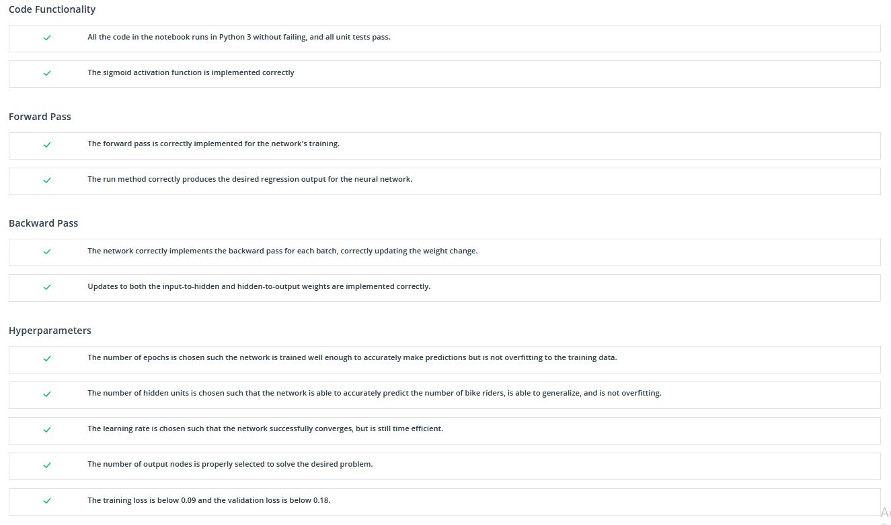
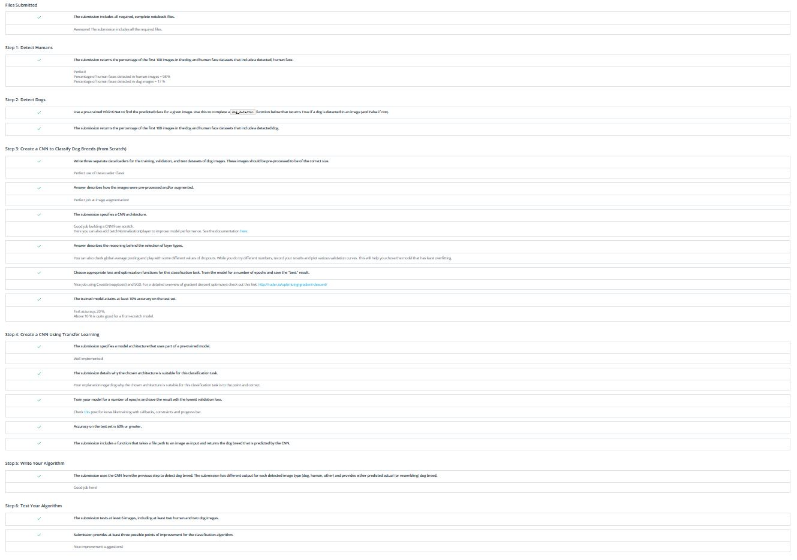
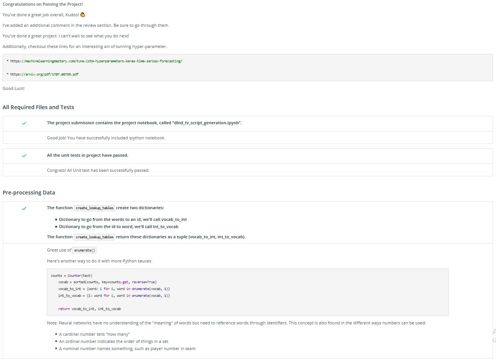
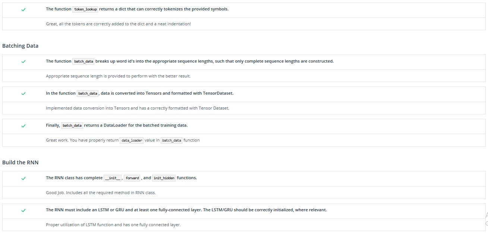
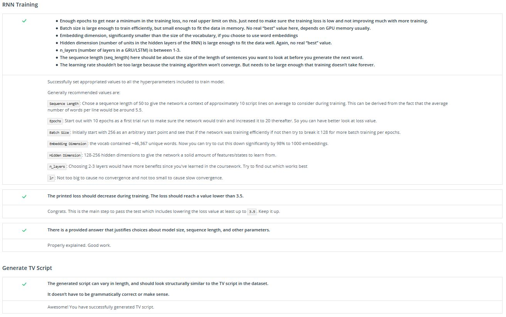
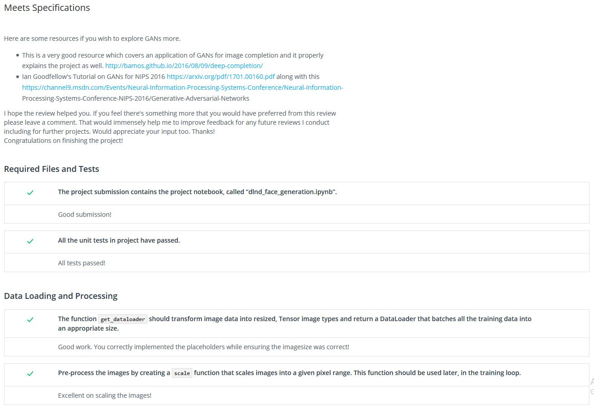
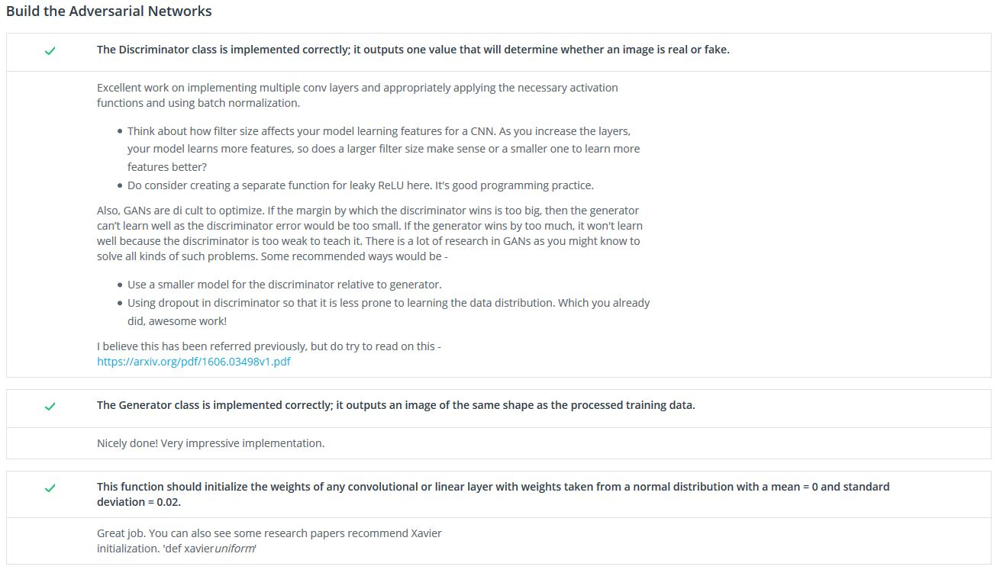
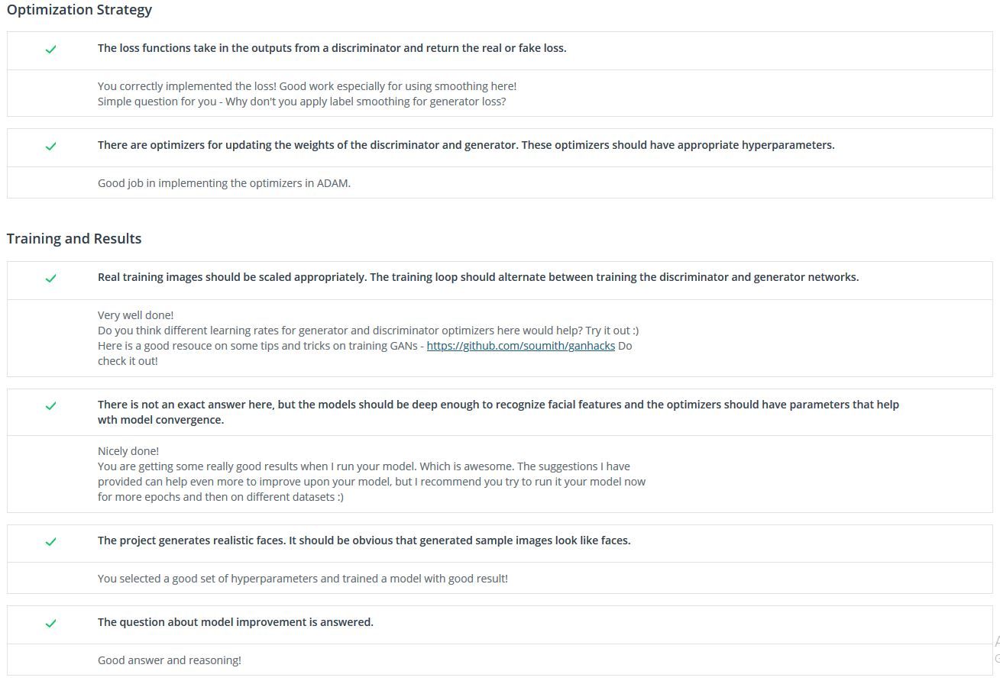

    
    <h1>Udacity Deep Learning Nanodegree</h1>
    
N.B.: Please don't use the assignment and quiz solution. Try to solve the problem by yourself.
 
    
Become an expert in neural networks, and learn to implement them using the deep learning framework PyTorch. Build convolutional networks for image recognition, recurrent networks for sequence generation, generative adversarial networks for image generation, and learn how to deploy models accessible from a website. - <a href="https://www.udacity.com/course/deep-learning-nanodegree--nd101">Source</a>

## Books
* **Grokking Deep Learning**: https://www.manning.com/books/grokking-deep-learning
* **Grokking Deep Learning Book's Excercise**: https://github.com/iamtrask/Grokking-Deep-Learning
* **Neural Networks And Deep Learning** by Michael Nielsen
* **The Deep Learning Textbook** from Ian Goodfellow, Yoshua Bengio, and Aaron Courville

## Resources

### AI, ML, DL
* [AI, Deep Learning, and Machine Learning: A Primer](https://www.youtube.com/watch?v=ht6fLrar91U)
* [DL in Cancer Detection](https://github.com/udacity/dermatologist-ai)

### Backpropagation 
* [Medium - Andrej Karpathy](https://medium.com/@karpathy/yes-you-should-understand-backprop-e2f06eab496b#.vt3ax2kg9)
* [Andrej Karpathy (a lecture from Stanford's CS231n course)](https://www.youtube.com/watch?v=59Hbtz7XgjM)

### Style Transfer
* [Fast style transfer](https://github.com/lengstrom/fast-style-transfer)

### CNN
* [Stanford's CS231n course](http://cs231n.github.io/convolutional-networks/)

### LSTMs
* [A Beginner's Guide to LSTMs and Recurrent Neural Networks](https://skymind.ai/wiki/lstm)
* [Understanding LSTM Networks - Colah's Blog](https://colah.github.io/posts/2015-08-Understanding-LSTMs/)

### Reinforcement learning
* [DeepTraffic](https://selfdrivingcars.mit.edu/deeptraffic/)
* [Flappy Bird](https://github.com/yenchenlin/DeepLearningFlappyBird)

### Residual Learning
* [An Overview of ResNet and its Variants](https://towardsdatascience.com/an-overview-of-resnet-and-its-variants-5281e2f56035)

### Attention
* [Attention is all you need - Lukasz Kaiser - Youtube](https://www.youtube.com/watch?v=rBCqOTEfxvg)

### GAN
* [iGAN - GitHub](https://github.com/junyanz/iGAN)
* [Attacking Machine Learning with Adversarial Examples](https://openai.com/blog/adversarial-example-research/)
* [Image-to-Image Demo](https://affinelayer.com/pixsrv/)
* [Pix2Pix and CycleGAN Github by Jun-Yan](https://github.com/junyanz/pytorch-CycleGAN-and-pix2pix)
* [CycleGAN](https://github.com/junyanz/CycleGAN)
* [Implementation of StarGAN](https://github.com/yunjey/StarGAN)

### Batch Normalization
* [PyTorch BatchNorm2d documentation](https://pytorch.org/docs/stable/nn.html#batchnorm2d)

### Machine Learning Workflow
* [AWS - Machine Learning Workflow](https://docs.aws.amazon.com/sagemaker/latest/dg/how-it-works-mlconcepts.html)
* [GCP - Machine Learning Workflow](https://cloud.google.com/ml-engine/docs/ml-solutions-overview)
* [Azure - Machine Learning Workflow](https://docs.microsoft.com/en-us/azure/machine-learning/service/overview-what-is-azure-ml)
* [Open Neural Network Exchange](https://onnx.ai/)

### GitHub
* [Getting started with writing and formatting on GitHub](https://help.github.com/en/categories/writing-on-github)
* [Basic writing and formatting syntax](https://help.github.com/en/articles/basic-writing-and-formatting-syntax)

### Others
* [MIT CSAIL](https://www.csail.mit.edu/)
* [Facebook AI Research](https://research.fb.com/category/facebook-ai-research/)

## Extra Projects
* [Generate your own Bach music using like - DeepBach](https://arxiv.org/pdf/1612.01010.pdf)
* [Predict seizures in intracranial EEG recordings on - Kaggle](https://www.kaggle.com/c/seizure-prediction)

## Core Curriculum

### 1. Introduction to Deep Learning
Get your first taste of deep learning by applying style transfer to your own images, and gain experience using development tools such as Anaconda and Jupyter notebooks.

#### Lesson-1: Welcome to the Deep Learning Nanodegree Program

| No |                                                        Lesson                                                         |                                                                                                                                  Topic                                                                                                                                   |                         Link/Source                          |
|:--:|:---------------------------------------------------------------------------------------------------------------------:|:-----------------------------------------------------------------------------------------------------------------------------------------------------------------------------------------------------------------------------------------------------------------------:|:------------------------------------------------------------:|
| 1 |                                        Welcome to the Deep Learning Nanodegree Program                                 |                                                                                                                      Application of Deep Learning                                                                                                                        |                       Source/GitHub                          |
| 2 |                                                   Meet Your Instructors                                                |                                                                                                                  Instructors-Matt, Luis and Cezanne                                                                                                                      |                       Source/GitHub                          |
| 3 |                                                     Program Structure                                                  |                                                                                        Course outline, Chapter Introduction, Project Guidelines                                                                                                                          |                         [GitHub](https://github.com/MrinmoiHossain/Udacity-Deep-Learning-Nanodegree/blob/master/1.Introduction_to_Deep_Learning/Lesson_1-Welcome_to_the_Deep_Learning_Nanodegree_Program/3.Program_Structure.md)                           |
| 4 |                                                   Community Guidelines                                                 |                                                                                                                  Details about the community rules                                                                                                                       |                         [GitHub](https://github.com/MrinmoiHossain/Udacity-Deep-Learning-Nanodegree/blob/master/1.Introduction_to_Deep_Learning/Lesson_1-Welcome_to_the_Deep_Learning_Nanodegree_Program/4.Community_Guidelines.md)                           |
| 5 |                                                      Prerequisites                                                     |                                                                                                                   Required programming and math skills                                                                                                                   |                         [GitHub](https://github.com/MrinmoiHossain/Udacity-Deep-Learning-Nanodegree/blob/master/1.Introduction_to_Deep_Learning/Lesson_1-Welcome_to_the_Deep_Learning_Nanodegree_Program/5.Prerequisites.md)                           |
| 6 |                                                     Getting Set Up                                                     |                                                                                                                 Required tools-Anaconda, Jupyter Notebook                                                                                                                |                         [Source](https://www.anaconda.com/)                           |

#### Lesson-2: Nanodegree Career Sevices
| No |                                                        Lesson                                                         |                                                                                                                                  Topic                                                                                                                                   |                         Link/Source                          |
|:--:|:---------------------------------------------------------------------------------------------------------------------:|:-----------------------------------------------------------------------------------------------------------------------------------------------------------------------------------------------------------------------------------------------------------------------:|:------------------------------------------------------------:|
| 1 |                                                 Access the Career Portal                                               |                                                                                                                                    Career portal guidelines                                                                                                              |                         [GitHub](https://github.com/MrinmoiHossain/Udacity-Deep-Learning-Nanodegree/blob/master/1.Introduction_to_Deep_Learning/Lesson_2-Nanodegree_Career_Sevices/1.Access_the_Career_Portal.md)                          |
| 2 |                                          Prepare for the Udacity Talent Program                                        |                                                                                                                Requirements for udacity profile, complete udacity profile                                                                                                |                         [GitHub](https://github.com/MrinmoiHossain/Udacity-Deep-Learning-Nanodegree/blob/master/1.Introduction_to_Deep_Learning/Lesson_2-Nanodegree_Career_Sevices/2.Prepare_for_the_Udacity_Talent_Program.md)                          |

#### Lesson-3: Welcome to Udacity
| No |                                                        Lesson                                                         |                                                                                                                                  Topic                                                                                                                                   |                         Link/Source                          |
|:--:|:---------------------------------------------------------------------------------------------------------------------:|:-----------------------------------------------------------------------------------------------------------------------------------------------------------------------------------------------------------------------------------------------------------------------:|:------------------------------------------------------------:|
| 1 |                                                      What It Takes                                                     |                                                                                                                                Description of Udacity Nanodegree                                                                                                         |                       Source/GitHub                          |
| 2 |                                                     Project Reviews                                                    |                                                                                                                               Project review and feedback system                                                                                                         |                       Source/GitHub                          |
| 3 |                                                         Knowledge                                                      |                                                                                                                              Tell about knowledge sharing website                                                                                                        |                         [Source](https://knowledge.udacity.com/?nanodegree=5cb06b9e-496f-11e8-b4f5-73f32bfb8079)                         |
| 4 |                                                  Mentors and Student Hub                                               |                                                                                                                    Helping support of the course - mentors and student hub                                                                                               |                         [Source](https://hub.udacity.com/)                         |
| 5 |                                                   Community Initiatives                                                |                                                                                                               Community introduction, project milestone and everyday challenge                                                                                          |                         [Source](https://sites.google.com/udacity.com/udacity-community-guide/community/30daysofudacity)                         |
| 6 |                                                   Meet the Careers Team                                                |                                                                                                                            Career guide lines for the mentors                                                                                                            |                       Source/GitHub                          |
| 7 |                                             Introduction to the Career Portal                                          |                                                                                                                                Create my career profile                                                                                                                  |                       Source/GitHub                          |
| 8 |                                                 Access Your Career Portal                                              |                                                                                                                             How to improve my career portal                                                                                                              |                       Source/GitHub                          |
| 9 |                                             Your Udacity Professional Profile                                          |                                                                                                        Udacity Professional Profile features important, professional information                                                                                         |                       Source/GitHub                          |
|10 |                                          Prepare for the Udacity Talent Program                                        |                                                                                                                      Udacity Talent Program, update udacity profile                                                                                                      |                       Source/GitHub                          |

#### Lesson-4: Get Help with Your Account
| No |                                                        Lesson                                                         |                                                                                                                                  Topic                                                                                                                                   |                         Link/Source                          |
|:--:|:---------------------------------------------------------------------------------------------------------------------:|:-----------------------------------------------------------------------------------------------------------------------------------------------------------------------------------------------------------------------------------------------------------------------:|:------------------------------------------------------------:|
| 1 |                                             Frequently Asked Questions (FAQ)                                           |                                                                                                                                     Frequently asked question and forum                                                                                                  |                         [Source](https://udacity.zendesk.com/hc/en-us)                          |
| 2 |                                                         Support                                                        |                                                                                                                                         Discuss about help center                                                                                                        |                         [Source](https://udacity.zendesk.com/hc/en-us/requests/new?ticket_form_id=110806)                          |

#### Lesson-5: Anaconda
| No |                                                        Lesson                                                         |                                                                                                                                  Topic                                                                                                                                   |                         Link/Source                          |
|:--:|:---------------------------------------------------------------------------------------------------------------------:|:-----------------------------------------------------------------------------------------------------------------------------------------------------------------------------------------------------------------------------------------------------------------------:|:------------------------------------------------------------:|
| 1 |                                                       Instructor                                                       |                                                                                                                              Instructor-Mat Leonard, welcome about anaconda                                                                                              |                       Source/GitHub                          |
| 2 |                                                      Introduction                                                      |                                                                                                                                  Conda or Anaconda installation step                                                                                                     |                         [Source](https://anaconda.org/)                           |
| 3 |                                                    What is Anaconda?                                                   |                                                                                                                         Anaconda's description, managing packages and environments                                                                                       |                       Source/GitHub                          |
| 4 |                                                   Installing Anaconda                                                  |                                                                                                                                        Installing Anaconda                                                                                                               |                         [Source](https://www.anaconda.com/download/)                           |
| 5 |                                                    Managing packages                                                   |                                                                                                                                     Managing packages system                                                                                                             |                       Source/GitHub                          |
| 6 |                                                  Managing environments                                                 |                                                                                                                          Managing and the using of the environments                                                                                                      |                       Source/GitHub                          |
| 7 |                                                 More environment actions                                               |                                                                                                                      Saving, loading, listing and removing environments                                                                                                  |                       Source/GitHub                          |
| 8 |                                                     Best practices                                                     |                                                                                                                                  Using and sharing environments                                                                                                          |                       Source/GitHub                          |
| 9 |                                               On Python versions at Udacity                                            |                                                                                                                             Why Python version-3 is used this course                                                                                                     |                       Source/GitHub                          |

#### Lesson-6: Applying Deep Learning
| No |                                                        Lesson                                                         |                                                                                                                                  Topic                                                                                                                                   |                         Link/Source                          |
|:--:|:---------------------------------------------------------------------------------------------------------------------:|:-----------------------------------------------------------------------------------------------------------------------------------------------------------------------------------------------------------------------------------------------------------------------:|:------------------------------------------------------------:|
| 1 |                                                      Introduction                                                      |                                                                                                                                         Overview of the lesson                                                                                                           |                       Source/GitHub                          |
| 2 |                                                     Style Transfer                                                     |                                                                                                                                   Overview about the style transfer                                                                                                      |                       Source/GitHub                          |
| 3 |                                                       DeepTraffic                                                      |                                                                                                                              Introduction the deepTrafic (application DL)                                                                                                |                       Source/GitHub                          |
| 4 |                                                       Flappy Bird                                                      |                                                                                                                                   DL application in Flappy Bird                                                                                                          |                       Source/GitHub                          |
| 5 |                                                      Books to Read                                                     |                                                                                                                                    Some suggested books for DL                                                                                                           |                       Source/GitHub                          |

#### Lesson-7: Jupyter Notebooks
| No |                                                        Lesson                                                         |                                                                                                                                  Topic                                                                                                                                   |                         Link/Source                          |
|:--:|:---------------------------------------------------------------------------------------------------------------------:|:-----------------------------------------------------------------------------------------------------------------------------------------------------------------------------------------------------------------------------------------------------------------------:|:------------------------------------------------------------:|
| 1 |                                                       Instructor                                                       |                                                                                                                Overview of Jupyter Notebook and Introduce the Mat Leonard, instructor                                                                                    |                       Source/GitHub                          |
| 2 |                                                What are Jupyter notebooks?                                             |                                                                                                        Introduction of jupyter notebook, Literate programming and How notebooks work                                                                             |                         [GitHub](https://github.com/MrinmoiHossain/Udacity-Deep-Learning-Nanodegree/tree/master/1.Introduction_to_Deep_Learning/Lesson_7-Jupyter_Notebooks)                           |
| 3 |                                                Installing Jupyter Notebook                                             |                                                                                                                      Installing process of Jupyter Notebook                                                                                                              |                       Source/GitHub                          |
| 4 |                                               Launching the notebook server                                            |                                                                                                                   Launching and shutdowing the notebook server                                                                                                           |                       Source/GitHub                          |
| 5 |                                                   Notebook interface                                                   |                                                                                                                Notebook interface - tool bar, command palette etc                                                                                                        |                       Source/GitHub                          |
| 6 |                                                       Code cells                                                       |                                                                                                                   What is Code cells and uses of it                                                                                                                      |                       Source/GitHub                          |
| 7 |                                                     Markdown cells                                                     |                                                                                               Writting procedure of markdown cells - headers, emphasis, code, math expressions                                                                                   |                       Source/GitHub                          |
| 8 |                                                   Keyboard shortcuts                                                   |                                                                                                                        Keyboard shortcuts                                                                                                                                |                       Source/GitHub                          |
| 9 |                                                     Magic keywords                                                     |                                                                                                                    Timing code, Embedding visualizations, Debugging                                                                                                      |                       Source/GitHub                          |
|10 |                                                  Converting notebooks                                                  |                                                                                                                     Converting notebooks in differents file format                                                                                                       |                       Source/GitHub                          |
|11 |                                                  Creating a slideshow                                                  |                                                                                                                     Creating and Running a slideshow                                                                                                                     |                       Source/GitHub                          |
|12 |                                                     Finishing up                                                       |                                                                                                                       Summary and finish message                                                                                                                         |                       Source/GitHub                          |

#### Lesson-8: Matrix Math and NumPy Refresher
| No |                                                        Lesson                                                         |                                                                                                                                  Topic                                                                                                                                   |                         Link/Source                          |
|:--:|:---------------------------------------------------------------------------------------------------------------------:|:-----------------------------------------------------------------------------------------------------------------------------------------------------------------------------------------------------------------------------------------------------------------------:|:------------------------------------------------------------:|
| 1 |                                                      Introduction                                                      |                                                                                                                  Matrix and importance in Deep Learning                                                                                                                  |                       Source/GitHub                          |
| 2 |                                                     Data Dimensions                                                    |                                                                                                                  Data dimensions - scalers, vector, matrix, tensors                                                                                                      |                       Source/GitHub                          |
| 3 |                                                      Data in NumPy                                                     |                                                                                                                          NumPy Introduction                                                                                                                              |                       Source/GitHub                          |
| 4 |                                             Element-wise Matrix Operations                                             |                                                                                                                    Matrices element wise operation                                                                                                                       |                       Source/GitHub                          |
| 5 |                                            Element-wise Operations in NumPy                                            |                                                                                                                Matrices element wise operation using NumPy                                                                                                               |                       Source/GitHub                          |
| 6 |                                             Matrix Multiplication: Part 1                                              |                                                                                                                Dot multiplication, element wise multiplication in metrices                                                                                               |                       Source/GitHub                          |
| 7 |                                             Matrix Multiplication: Part 2                                              |                                                                                                                  Important note about matrix multiplication                                                                                                              |                       Source/GitHub                          |
| 8 |                                              NumPy Matrix Multiplication                                               |                                                                                                                       NumPy Matrix Multiplication                                                                                                                        |                       Source/GitHub                          |
| 9 |                                                   Matrix Transposes                                                    |                                                                                                                 Matrix Transposes and where use of it                                                                                                                    |                       Source/GitHub                          |
|10 |                                                  Transposes in NumPy                                                   |                                                                                                                   Transposes matrices in NumPy                                                                                                                           |                       Source/GitHub                          |
|11 |                                                      NumPy Quiz                                                        |                                                                                                                 Short programming quiz that asks to use a few NumPy features                                                                                             |                         [GitHub](https://github.com/MrinmoiHossain/Udacity-Deep-Learning-Nanodegree/tree/master/1.Introduction_to_Deep_Learning/Lesson_8-Matrix_Math_and_NumPy_Refresher/11.NumPy_Quiz)                           |

### 2. Neural Networks
Learn neural networks basics, and build your first network with Python and NumPy. Use the modern deep learning framework PyTorch to build multi-layer neural networks, and analyze real data.

#### Lesson-1: Introduction to Neural Networks

#### Lesson-2: Implementing Gradient Descent

#### Lesson-3: Training Neural Networks

#### Lesson-4: GPU Workspaces Demo

#### Lesson-5: Sentiment Analysis

#### Lesson-6: Deep Learning with PyTorch

### 3. Convolutional Neural Networks
Learn how to build convolutional networks and use them to classify images (faces, melanomas, etc.) based on patterns and objects that appear in them. Use these networks to learn data compression and image denoising.

#### Lesson-1: Convolutional Neural Networks

#### Lesson-2: Cloud Computing

#### Lesson-3: Transfer Learning

#### Lesson-4: Weight Initialization

#### Lesson-5: Autoencoders

#### Lesson-6: Style Transfer

#### Lesson-7: Deep Learning for Cancer Detection

#### Lesson-8: Jobs in Deep Learning

### 4. Recurrent Neural Networks
Build your own recurrent networks and long short-term memory networks with PyTorch; perform sentiment analysis and use recurrent networks to generate new text from TV scripts.

#### Lesson-1: Recurrent Neural Networks

#### Lesson-2: Long Short-Term Memory Networks (LSTMs)

#### Lesson-3: Implementation of RNN & LSTM

#### Lesson-4: Hyperparameters

#### Lesson-5: Embedding & Word2Vec

#### Lesson-6: Sentiment Prediction RNN
| No |                                                        Lesson                                                         |                                                                                                                                  Topic                                                                                                                                   |                         Link/Source                          |
|:--:|:---------------------------------------------------------------------------------------------------------------------:|:-----------------------------------------------------------------------------------------------------------------------------------------------------------------------------------------------------------------------------------------------------------------------:|:------------------------------------------------------------:|
| 1 |                                                Sentiment RNN, Introduction                                             |                                                                                                                   LSTM example, Sentiment analysis                                                                                                                       |                       Source/GitHub                          |
| 2 |                                                Pre-Notebook: Sentiment RNN                                             |                                                                                     Implementing a complete RNN that can classify the sentiment of movie reviews                                                                                                      |                         [Source](https://github.com/udacity/deep-learning-v2-pytorch/blob/master/sentiment-rnn/Sentiment_RNN_Solution.ipynb)                          |
| 3 |                                                  Notebook: Sentiment RNN                                               |                                                                                     Implementing a complete RNN that can classify the sentiment of movie reviews                                                                                                      |                         [GitHub](https://github.com/MrinmoiHossain/Udacity-Deep-Learning-Nanodegree/blob/master/4.Recurrent_Neural_Networks/Lesson_6-Sentiment_Prediction_RNN/3.Notebook_Sentiment_RNN/Sentiment_RNN_Exercise.ipynb)                           |
| 4 |                                                    Data Pre-Processing                                                 |                                                                                                             Import data, Remove punctuation, Split data into list                                                                                                     |                         [GitHub](https://github.com/MrinmoiHossain/Udacity-Deep-Learning-Nanodegree/blob/master/4.Recurrent_Neural_Networks/Lesson_6-Sentiment_Prediction_RNN/3.Notebook_Sentiment_RNN/Sentiment_RNN_Exercise.ipynb)                           |
| 5 |                                                 Encoding Words, Solution                                               |                                                                                                            Encoding the word & label as conver to word to integers                                                                                                   |                         [GitHub](https://github.com/MrinmoiHossain/Udacity-Deep-Learning-Nanodegree/blob/master/4.Recurrent_Neural_Networks/Lesson_6-Sentiment_Prediction_RNN/3.Notebook_Sentiment_RNN/Sentiment_RNN_Exercise.ipynb)                           |
| 6 |                                                Getting Rid of Zero-Length                                              |                                                                                               Set all the input size as standard, remove zero len data and modify high len data                                                                                     |                         [GitHub](https://github.com/MrinmoiHossain/Udacity-Deep-Learning-Nanodegree/blob/master/4.Recurrent_Neural_Networks/Lesson_6-Sentiment_Prediction_RNN/3.Notebook_Sentiment_RNN/Sentiment_RNN_Exercise.ipynb)                           |
| 7 |                                                 Cleaning & Padding Data                                                |                                                                                                                               Removing zero length data                                                                                                                  |                         [GitHub](https://github.com/MrinmoiHossain/Udacity-Deep-Learning-Nanodegree/blob/master/4.Recurrent_Neural_Networks/Lesson_6-Sentiment_Prediction_RNN/3.Notebook_Sentiment_RNN/Sentiment_RNN_Exercise.ipynb)                           |
| 8 |                                                Padded Features, Solution                                               |                                                                                                                     Pad or truncate all data to a specific length                                                                                                        |                         [GitHub](https://github.com/MrinmoiHossain/Udacity-Deep-Learning-Nanodegree/blob/master/4.Recurrent_Neural_Networks/Lesson_6-Sentiment_Prediction_RNN/3.Notebook_Sentiment_RNN/Sentiment_RNN_Exercise.ipynb)                           |
| 9 |                                              TensorDataset & Batching Data                                             |                                                                                        Split the train-validation-test data, Data loaded from numpy to tensor, Data loaded with batch size                                                                       |                         [GitHub](https://github.com/MrinmoiHossain/Udacity-Deep-Learning-Nanodegree/blob/master/4.Recurrent_Neural_Networks/Lesson_6-Sentiment_Prediction_RNN/3.Notebook_Sentiment_RNN/Sentiment_RNN_Exercise.ipynb)                           |
|10 |                                                   Defining the Model                                                   |                                                                                                                        Introduction about the model of the network                                                                                                       |                         [GitHub](https://github.com/MrinmoiHossain/Udacity-Deep-Learning-Nanodegree/blob/master/4.Recurrent_Neural_Networks/Lesson_6-Sentiment_Prediction_RNN/3.Notebook_Sentiment_RNN/Sentiment_RNN_Exercise.ipynb)                           |
|11 |                                                 Complete Sentiment RNN                                                 |                                                                                                    Initialize the model parameters, Feedforward network, Backpropagation, Initializes hidden state                                                                      |                         [GitHub](https://github.com/MrinmoiHossain/Udacity-Deep-Learning-Nanodegree/blob/master/4.Recurrent_Neural_Networks/Lesson_6-Sentiment_Prediction_RNN/3.Notebook_Sentiment_RNN/Sentiment_RNN_Exercise.ipynb)                           |
|12 |                                                   Training the Model                                                   |                                                                                                                      Hyperparameters, Loss function and Optimization                                                                                                     |                         [GitHub](https://github.com/MrinmoiHossain/Udacity-Deep-Learning-Nanodegree/blob/master/4.Recurrent_Neural_Networks/Lesson_6-Sentiment_Prediction_RNN/3.Notebook_Sentiment_RNN/Sentiment_RNN_Exercise.ipynb)                           |
|13 |                                                        Testing                                                         |                                                                                                                                   Testing the model                                                                                                                      |                         [GitHub](https://github.com/MrinmoiHossain/Udacity-Deep-Learning-Nanodegree/blob/master/4.Recurrent_Neural_Networks/Lesson_6-Sentiment_Prediction_RNN/3.Notebook_Sentiment_RNN/Sentiment_RNN_Exercise.ipynb)                           |
|14 |                                                  Inference, Solution                                                   |                                                                                                                                                Inference                                                                                                                 |                         [GitHub](https://github.com/MrinmoiHossain/Udacity-Deep-Learning-Nanodegree/blob/master/4.Recurrent_Neural_Networks/Lesson_6-Sentiment_Prediction_RNN/3.Notebook_Sentiment_RNN/Sentiment_RNN_Exercise.ipynb)                           |

#### Lesson-7: Attention
| No |                                                        Lesson                                                         |                                                                                                                                  Topic                                                                                                                                   |                         Link/Source                          |
|:--:|:---------------------------------------------------------------------------------------------------------------------:|:-----------------------------------------------------------------------------------------------------------------------------------------------------------------------------------------------------------------------------------------------------------------------:|:------------------------------------------------------------:|
| 1 |                                               Introduction to Attention                                                |                                                                                                             Introduction and defination of Attention, Application and where uses attention                                                                            |                       Source/GitHub                          |
| 2 |                                                Encoders and Decoders                                                   |                                                                                                                           Sequence-to-sequence models, encoders, decoders                                                                                                |                       Source/GitHub                          |
| 3 |                                             Sequence to Sequence Recap                                                 |                                                                                                                      Review of sequence-to-sequence models, encoders, decoders                                                                                           |                       Source/GitHub                          |
| 4 |                                            Encoding -- Attention Overview                                              |                                                                                                                                      Overview of encoding in Attention                                                                                                   |                       Source/GitHub                          |
| 5 |                                            Decoding -- Attention Overview                                              |                                                                                                                                      Overview of decoding in Attention                                                                                                   |                       Source/GitHub                          |
| 6 |                                                  Attention Overview                                                    |                                                                                                                                    Example and question about attention                                                                                                  |                       Source/GitHub                          |
| 7 |                                                  Attention Encoder                                                     |                                                                                                                        Behind the scenario of encoder algorithms in attention                                                                                            |                       Source/GitHub                          |
| 8 |                                                  Attention Decoder                                                     |                                                                                                                         Backbone of decoder and the Attention decoder phase                                                                                              |                       Source/GitHub                          |
| 9 |                                             Attention Encoder & Decoder                                                |                                                                                                                                Quiz about encoder and decoder                                                                                                            |                       Source/GitHub                          |
|10 |                                             Bahdanau and Luong Attention                                               |                                                                                                              Bahdanu/Additive Attention and Luong/Multiplicative Attention Model Introduction                                                                          |                       Source/GitHub                          |
|11 |                                               Multiplicative Attention                                                 |                                                                                                                  Details architecture of Multiplicative Attention                                                                                                        |                       Source/GitHub                          |
|12 |                                                  Additive Attention                                                    |                                                                                                              3-Concat attention and details architecture of Additive Attention                                                                                         |                       Source/GitHub                          |
|13 |                                         Additive and Multiplicative Attention                                          |                                                                                                                  Quiz: Additive and Multiplicative Attention                                                                                                             |                       Source/GitHub                          |
|14 |                                             Computer Vision Applications                                               |                                                                                                                  Example of computer vision applications with attention                                                                                                  |                       Source/GitHub                          |
|15 |                                               Other Attention Methods                                                  |                                                                                                             The transformer models and indside of the model (encoder and decoder part)                                                                                |                       Source/GitHub                          |
|16 |                                          The Transformer and Self-Attention                                            |                                                                                                                   Full details of the Transformer and Self-Attention architecture                                                                                        |                       Source/GitHub                          |
|17 |                                             Notebook: Attention Basics                                                 |                                                                                                         Attention Basic function-Scoring, Annotations Matrix, Softmax, Attention Context Vector                                                                   |                         [GitHub](https://github.com/MrinmoiHossain/Udacity-Deep-Learning-Nanodegree/tree/master/4.Recurrent_Neural_Networks/Lesson_7-Attention/17.Notebook-Attention_Basics)                           |
|18 |                                            [SOLUTION]: Attention Basics                                                |                                                                                                         Attention Basic function-Scoring, Annotations Matrix, Softmax, Attention Context Vector                                                                   |                         [GitHub](https://github.com/MrinmoiHossain/Udacity-Deep-Learning-Nanodegree/tree/master/4.Recurrent_Neural_Networks/Lesson_7-Attention/18.Solution-Attention_Basics)                           |
|19 |                                                        Outro                                                           |                                                                                                              Ending message and remainder the most important information in that data                                                                                  |                       Source/GitHub                          |

### 5. Generative Adversarial Networks
Learn to understand and implement a Deep Convolutional GAN (generative adversarial network) to generate realistic images, with Ian Goodfellow, the inventor of GANs, and Jun-Yan Zhu, the creator of CycleGANs.

#### Lesson-1: Generative Adversarial Networks
| No |                                                        Lesson                                                         |                                                                                                                                  Topic                                                                                                                                   |                         Link/Source                          |
|:--:|:---------------------------------------------------------------------------------------------------------------------:|:-----------------------------------------------------------------------------------------------------------------------------------------------------------------------------------------------------------------------------------------------------------------------:|:------------------------------------------------------------:|
| 1 |                                                Introducing Ian GoodFellow                                              |                                                                                                                   Introduction about Ian Goodfellow and his experience                                                                                                   |                       Source/GitHub                          |
| 2 |                                                   Applications of GANs                                                 |                                                  What you can do with GAN, as- text to images, art to realistic image, face to cartoon, dat to night mode, unsupervised image-to-image, Imitation learning                                                      |                       Source/GitHub                          |
| 3 |                                                      How GANs work                                                     |                                                                                                                 Autoregressive model, Process of GAN, Generator models & Discriminator                                                                                   |                       Source/GitHub                          |
| 4 |                                                  Games and Equilibria                                                  |                                                                                                                 Game theory, Rock-Paper-Scissors game, Equilibriam situtation                                                                                            |                       Source/GitHub                          |
| 5 |                                                 Tips for Training GANs                                                 |                                                                                                     GAN layers architecture, activation and loss functions for generator & discriminator, batch normalization                                                            |                       Source/GitHub                          |
| 6 |                                                 Generating Fake Images                                                 |                                                                                                                 Excercise dataset introduction, MNIST dataset - fake or real image                                                                                       |                       Source/GitHub                          |
| 7 |                                                       MNIST GAN                                                        |                                                                                                                   Built a GAN to generate new images of handwritten digits                                                                                               |                       Source/GitHub                          |
| 8 |                                                  GAN Notebook & Data                                                   |                                                                                                                         Introduction the excercise and datasets                                                                                                          |                       Source/GitHub                          |
| 9 |                                                Pre-Notebook: MNIST GAN                                                 |                                                                                                                  All about generating new images of handwritten digits                                                                                                   |                        [Solution](https://github.com/udacity/deep-learning-v2-pytorch/blob/master/gan-mnist/MNIST_GAN_Solution.ipynb)                          |
|10 |                                                  Notebook: MNIST GAN                                                   |                                                                                                                                 Excercise of GAN                                                                                                                         |                         [GitHub](https://github.com/MrinmoiHossain/Udacity-Deep-Learning-Nanodegree/blob/master/5.Generative_Adversarial_Networks/Lesson_1-Generative_Adversarial_Networks/10.Notebook_MNIST_GAN/MNIST_GAN_Exercise.ipynb)                           |
|11 |                                                   The Complete Model                                                   |                                                                                                                             Hints of the complete model                                                                                                                  |                         [GitHub](https://github.com/MrinmoiHossain/Udacity-Deep-Learning-Nanodegree/blob/master/5.Generative_Adversarial_Networks/Lesson_1-Generative_Adversarial_Networks/10.Notebook_MNIST_GAN/MNIST_GAN_Exercise.ipynb)                           |
|12 |                                                Generator & Discriminator                                               |                                                                                                                     Generator and Discriminator Model implementation                                                                                                     |                         [GitHub](https://github.com/MrinmoiHossain/Udacity-Deep-Learning-Nanodegree/blob/master/5.Generative_Adversarial_Networks/Lesson_1-Generative_Adversarial_Networks/10.Notebook_MNIST_GAN/MNIST_GAN_Exercise.ipynb)                           |
|13 |                                                    Hyperparameters                                                     |                                                                                                                          Hyperparameters set for the excercise                                                                                                           |                         [GitHub](https://github.com/MrinmoiHossain/Udacity-Deep-Learning-Nanodegree/blob/master/5.Generative_Adversarial_Networks/Lesson_1-Generative_Adversarial_Networks/10.Notebook_MNIST_GAN/MNIST_GAN_Exercise.ipynb)                           |
|14 |                                                 Fake and Real Losses                                                   |                                                                                                                      Loss calculation for the fake & real models                                                                                                         |                         [GitHub](https://github.com/MrinmoiHossain/Udacity-Deep-Learning-Nanodegree/blob/master/5.Generative_Adversarial_Networks/Lesson_1-Generative_Adversarial_Networks/10.Notebook_MNIST_GAN/MNIST_GAN_Exercise.ipynb)                           |
|15 |                                            Optimization Strategy, Solution                                             |                                                                                                                      Adam optimization is used for D & G models                                                                                                          |                         [GitHub](https://github.com/MrinmoiHossain/Udacity-Deep-Learning-Nanodegree/blob/master/5.Generative_Adversarial_Networks/Lesson_1-Generative_Adversarial_Networks/10.Notebook_MNIST_GAN/MNIST_GAN_Exercise.ipynb)                           |
|16 |                                                 Training Two Networks                                                  |                                                                                                                    Complete the training of the networks                                                                                                                 |                         [GitHub](https://github.com/MrinmoiHossain/Udacity-Deep-Learning-Nanodegree/blob/master/5.Generative_Adversarial_Networks/Lesson_1-Generative_Adversarial_Networks/10.Notebook_MNIST_GAN/MNIST_GAN_Exercise.ipynb)                           |
|17 |                                                   Training Solution                                                    |                                                                                                                  Solution of the training of the networks                                                                                                                |                         [GitHub](https://github.com/MrinmoiHossain/Udacity-Deep-Learning-Nanodegree/blob/master/5.Generative_Adversarial_Networks/Lesson_1-Generative_Adversarial_Networks/10.Notebook_MNIST_GAN/MNIST_GAN_Exercise.ipynb)                           |

#### Lesson-2: Deep Convolutional GANs
| No |                                                        Lesson                                                         |                                                                                                                                  Topic                                                                                                                                   |                         Link/Source                          |
|:--:|:---------------------------------------------------------------------------------------------------------------------:|:-----------------------------------------------------------------------------------------------------------------------------------------------------------------------------------------------------------------------------------------------------------------------:|:------------------------------------------------------------:|
| 1 |                                                 Deep Convolutional GANs                                                |                                                                                                                        Introduction about Deep convolutional GANs                                                                                                        |                       Source/GitHub                          |
| 2 |                                                   DCGAN, Discriminator                                                 |                                                                                                                              DCGAN Architecture basic                                                                                                                    |                       Source/GitHub                          |
| 3 |                                                     DCGAN Generator                                                    |                                                                                                                   DCGAN Generator, transpose convolutional network                                                                                                       |                       Source/GitHub                          |
| 4 |                                               What is Batch Normalization?                                             |                                                                                                               Batch normalization defination and mathematical calculation                                                                                               |                       Source/GitHub                          |
| 5 |                                                 Pre-Notebook: Batch Norm                                               |                                                                                                                            Excercise of Batch Norm                                                                                                                       |                       Source/GitHub                          |
| 6 |                                                   Notebook: Batch Norm                                                 |                                                                                                                            Excercise of Batch Norm                                                                                                                       |                       Source/GitHub                          |
| 7 |                                             Benefits of Batch Normalization                                            |                                                                                                                     Describe the benefits of Batch Normalization                                                                                                         |                       Source/GitHub                          |
| 8 |                                                  DCGAN Notebook & Data                                                 |                                                                                                                          DCGAN Excercise introduction                                                                                                                    |                       Source/GitHub                          |
| 9 |                                                Pre-Notebook: DCGAN, SVHN                                               |                                                                                                                           Excercise of DCGAN, SVHN                                                                                                                       |                         [Source](https://github.com/udacity/deep-learning-v2-pytorch/blob/master/dcgan-svhn/DCGAN_Solution.ipynb)                           |
|10 |                                                  Notebook: DCGAN, SVHN                                                 |                                                                                                                           Excercise of DCGAN, SVHN                                                                                                                       |                         [GitHub](https://github.com/MrinmoiHossain/Udacity-Deep-Learning-Nanodegree/blob/master/5.Generative_Adversarial_Networks/Lesson_2-Deep_Convolutional_GANs/10.Notebook_DCGAN_SVHN/DCGAN_Exercise.ipynb)                           |
|11 |                                                   Scaling, Solution                                                    |                                                                                                                             Scaling calculation                                                                                                                          |                         [GitHub](https://github.com/MrinmoiHossain/Udacity-Deep-Learning-Nanodegree/blob/master/5.Generative_Adversarial_Networks/Lesson_2-Deep_Convolutional_GANs/10.Notebook_DCGAN_SVHN/DCGAN_Exercise.ipynb)                           |
|12 |                                                     Discriminator                                                      |                                                                                                                  Discriminator architecture for this network                                                                                                             |                         [GitHub](https://github.com/MrinmoiHossain/Udacity-Deep-Learning-Nanodegree/blob/master/5.Generative_Adversarial_Networks/Lesson_2-Deep_Convolutional_GANs/10.Notebook_DCGAN_SVHN/DCGAN_Exercise.ipynb)                           |
|13 |                                                Discriminator, Solution                                                 |                                                                                                                Discriminator architecture solution for this network                                                                                                      |                         [GitHub](https://github.com/MrinmoiHossain/Udacity-Deep-Learning-Nanodegree/blob/master/5.Generative_Adversarial_Networks/Lesson_2-Deep_Convolutional_GANs/10.Notebook_DCGAN_SVHN/DCGAN_Exercise.ipynb)                           |
|14 |                                                        Generator                                                       |                                                                                                                  Describe the general structure of the generator                                                                                                         |                         [GitHub](https://github.com/MrinmoiHossain/Udacity-Deep-Learning-Nanodegree/blob/master/5.Generative_Adversarial_Networks/Lesson_2-Deep_Convolutional_GANs/10.Notebook_DCGAN_SVHN/DCGAN_Exercise.ipynb)                           |
|15 |                                                  Generator, Solution                                                   |                                                                                                                      The solution of the generator model                                                                                                                 |                         [GitHub](https://github.com/MrinmoiHossain/Udacity-Deep-Learning-Nanodegree/blob/master/5.Generative_Adversarial_Networks/Lesson_2-Deep_Convolutional_GANs/10.Notebook_DCGAN_SVHN/DCGAN_Exercise.ipynb)                           |
|16 |                                                 Optimization Strategy                                                  |                                                                                                                   Optimization parameters set for the model                                                                                                              |                         [GitHub](https://github.com/MrinmoiHossain/Udacity-Deep-Learning-Nanodegree/blob/master/5.Generative_Adversarial_Networks/Lesson_2-Deep_Convolutional_GANs/10.Notebook_DCGAN_SVHN/DCGAN_Exercise.ipynb)                           |
|17 |                                            Optimization Solution & Samples                                             |                                                                                                                    The solution of Optimization parameters                                                                                                               |                         [GitHub](https://github.com/MrinmoiHossain/Udacity-Deep-Learning-Nanodegree/blob/master/5.Generative_Adversarial_Networks/Lesson_2-Deep_Convolutional_GANs/10.Notebook_DCGAN_SVHN/DCGAN_Exercise.ipynb)                           |
|18 |                                              Other Applications of GANs                                                |                                                                                       More about GAN - Semi-Supervised Learning, Domain Invariance, Ethical and Artistic Applications: Further Reading                                                                |                       Source/GitHub                          |

#### Lesson-3: Pix2Pix & CycleGAN
| No |                                                        Lesson                                                         |                                                                                                                                  Topic                                                                                                                                   |                         Link/Source                          |
|:--:|:---------------------------------------------------------------------------------------------------------------------:|:-----------------------------------------------------------------------------------------------------------------------------------------------------------------------------------------------------------------------------------------------------------------------:|:------------------------------------------------------------:|
| 1 |                                                 Introducing Jun-Yan Zhu                                                |                                                                                                             Introduction of Jun-Yan Zhu and his background, Intorduction CycleGAN, Pix2Pix                                                                            |                       Source/GitHub                          |
| 2 |                                               Image to Image Translation                                               |                                                                                                                     Image to image translation with example                                                                                                              |                       Source/GitHub                          |
| 3 |                                                 Designing Loss Functions                                               |                                                                                                                  Loss are calculated using Euclidean distance                                                                                                            |                       Source/GitHub                          |
| 4 |                                                      GANs, a Recap                                                     |                                                                                                              Full review of Generator, Descrimenator of GAN network                                                                                                    |                         [GitHub](https://github.com/MrinmoiHossain/Udacity-Deep-Learning-Nanodegree/tree/master/5.Generative_Adversarial_Networks/Lesson_3-Pix2Pix_and_CycleGAN/4.GANs_A_Recap)                           |
| 5 |                                                    Pix2Pix Generator                                                   |                                                                                                                      What changes of Pix2Pix Generator                                                                                                                   |                       Source/GitHub                          |
| 6 |                                                  Pix2Pix Discriminator                                                 |                                                                                                                    What changes of Pix2Pix Discriminator                                                                                                                 |                       Source/GitHub                          |
| 7 |                                                CycleGANs & Unpaired Data                                               |                                                                                                               Unpaired data, Mappings, Inverse mappings                                                                                                                 |                       Source/GitHub                          |
| 8 |                                                  Cycle Consistency Loss                                                |                                                                                                               Calculate the Cycle Consistency Loss                                                                                                                      |                       Source/GitHub                          |
| 9 |                                                   Why Does This Work?                                                  |                                                                                                                   Weaknesses of CycleGAN                                                                                                                                 |                       Source/GitHub                          |
|10 |                                                     Beyond CycleGANs                                                   |                                                                                                             Augmented CycleGAN, Paired CycleGAN, Cross-domain models, StarGAN                                                                                         |                       Source/GitHub                          |

#### Lesson-4: Implementing a CycleGAN
| No |                                                        Lesson                                                         |                                                                                                                                  Topic                                                                                                                                   |                         Link/Source                          |
|:--:|:---------------------------------------------------------------------------------------------------------------------:|:-----------------------------------------------------------------------------------------------------------------------------------------------------------------------------------------------------------------------------------------------------------------------:|:------------------------------------------------------------:|
| 1 |                                                  CycleGAN Notebook & Data                                              |                                                                                                             Introduction of the excercise, datasets, objective of the excercise                                                                                       |                       Source/GitHub                          |
| 2 |                                                   Pre-Notebook: CycleGAN                                               |                                                                                                                                  CycleGAN Excercise                                                                                                                      |                         [Source](https://github.com/udacity/deep-learning-v2-pytorch/blob/master/cycle-gan/CycleGAN_Solution.ipynb)                           |
| 3 |                                                     Notebook: CycleGAN                                                 |                                                                                                                                Excercise of CycleGAN                                                                                                                     |                         [GitHub](https://github.com/MrinmoiHossain/Udacity-Deep-Learning-Nanodegree/tree/master/5.Generative_Adversarial_Networks/Lesson_4-Implementing_A_CycleGAN/3.Notebook_CycleGAN)                           |
| 4 |                                                      DC Discriminator                                                  |                                                                                                                      Implement the Discriminator Function                                                                                                                |                         [GitHub](https://github.com/MrinmoiHossain/Udacity-Deep-Learning-Nanodegree/blob/master/5.Generative_Adversarial_Networks/Lesson_4-Implementing_A_CycleGAN/3.Notebook_CycleGAN/CycleGAN_Exercise.ipynb)                           |
| 5 |                                                 DC Discriminator, Solution                                             |                                                                                                                    Solution of the Discriminator Function                                                                                                                |                         [GitHub](https://github.com/MrinmoiHossain/Udacity-Deep-Learning-Nanodegree/blob/master/5.Generative_Adversarial_Networks/Lesson_4-Implementing_A_CycleGAN/3.Notebook_CycleGAN/CycleGAN_Exercise.ipynb)                           |
| 6 |                                                Generator & Residual Blocks                                             |                                                                                                              Uses of Residual Blocks and it uses in the excercise                                                                                                      |                         [GitHub](https://github.com/MrinmoiHossain/Udacity-Deep-Learning-Nanodegree/blob/master/5.Generative_Adversarial_Networks/Lesson_4-Implementing_A_CycleGAN/3.Notebook_CycleGAN/CycleGAN_Exercise.ipynb)                           |
| 7 |                                                    CycleGAN Generator                                                  |                                                                                                                 Implement of Residual Blocks and Generator Function                                                                                                      |                         [GitHub](https://github.com/MrinmoiHossain/Udacity-Deep-Learning-Nanodegree/blob/master/5.Generative_Adversarial_Networks/Lesson_4-Implementing_A_CycleGAN/3.Notebook_CycleGAN/CycleGAN_Exercise.ipynb)                           |
| 8 |                                               Blocks & Generator, Solution                                             |                                                                                                                Solution of Residual Blocks and Generator Function                                                                                                        |                         [GitHub](https://github.com/MrinmoiHossain/Udacity-Deep-Learning-Nanodegree/blob/master/5.Generative_Adversarial_Networks/Lesson_4-Implementing_A_CycleGAN/3.Notebook_CycleGAN/CycleGAN_Exercise.ipynb)                           |
| 9 |                                          Adversarial & Cycle Consistency Losses                                        |                                                                                                                 Description of Adversarial & Cycle Consistency Losses                                                                                                    |                         [GitHub](https://github.com/MrinmoiHossain/Udacity-Deep-Learning-Nanodegree/blob/master/5.Generative_Adversarial_Networks/Lesson_4-Implementing_A_CycleGAN/3.Notebook_CycleGAN/CycleGAN_Exercise.ipynb)                           |
|10 |                                                Loss & Optimization, Solution                                           |                                                                                                                        Solution of Loss and optimization                                                                                                                 |                         [GitHub](https://github.com/MrinmoiHossain/Udacity-Deep-Learning-Nanodegree/blob/master/5.Generative_Adversarial_Networks/Lesson_4-Implementing_A_CycleGAN/3.Notebook_CycleGAN/CycleGAN_Exercise.ipynb)                           |
|11 |                                                     Training Exercise                                                  |                                                                                                                 Implement the training function for descrimenator and generator                                                                                          |                         [GitHub](https://github.com/MrinmoiHossain/Udacity-Deep-Learning-Nanodegree/blob/master/5.Generative_Adversarial_Networks/Lesson_4-Implementing_A_CycleGAN/3.Notebook_CycleGAN/CycleGAN_Exercise.ipynb)                           |
|12 |                                          Training Solution & Generated Samples                                         |                                                                                                             Introduction of the excercise, datasets, objective of the excercise                                                                                       |                         [GitHub](https://github.com/MrinmoiHossain/Udacity-Deep-Learning-Nanodegree/blob/master/5.Generative_Adversarial_Networks/Lesson_4-Implementing_A_CycleGAN/3.Notebook_CycleGAN/CycleGAN_Exercise.ipynb)                           |

### 6. Deploying a Model
Train and deploy your own PyTorch sentiment analysis model. Deployment gives you the ability to use a trained model to analyze new, user input. Build a model, deploy it, and create a gateway for accessing it from a website.

#### Lesson-1: Introduction to Deployment
| No |                                                        Lesson                                                         |                                                                                                                                  Topic                                                                                                                                   |                         Link/Source                          |
|:--:|:---------------------------------------------------------------------------------------------------------------------:|:-----------------------------------------------------------------------------------------------------------------------------------------------------------------------------------------------------------------------------------------------------------------------:|:------------------------------------------------------------:|
| 1 |                                                        Welcome!                                                        |                                                                                                                Instructor introduction, deployment lesson introduction                                                                                                   |                       Source/GitHub                          |
| 2 |                                                      What's Ahead                                                      |                                                                                                                Behind the scenario of deployment, reason of using and it's characteristcs                                                                                |                       Source/GitHub                          |
| 3 |                                                   Problem Introduction                                                 |                                                                                                                How to approach a real life problem using machine learning                                                                                                |                       Source/GitHub                          |
| 4 |                                                Machine Learning Workflow                                               |                                                                                                               Structure of machine learning workflow with example                                                                                                       |                       Source/GitHub                          |
| 5 |                                                Machine Learning Workflow                                               |                                                                                                                       Machine learning structure quiz                                                                                                                    |                       Source/GitHub                          |
| 6 |                                             What is Cloud Computing & Why                                              |                                                                                                              Cloud computing defination, benfits, risks and now mostly why it is used                                                                                  |                       Source/GitHub                          |
| 7 |                                               Why Cloud Computing?                                                     |                                                                                                                           Cloud computing quiz                                                                                                                           |                       Source/GitHub                          |
| 8 |                                             Machine Learning Applications                                              |                                                                                                                 Machine Learning Applications, Example of ML in the workplace                                                                                            |                       Source/GitHub                          |
| 9 |                                             Machine Learning Applications                                              |                                                                                                                Machine Learning Applications, Example of ML in the workplace                                                                                             |                       Source/GitHub                          |
|10 |                                                Paths to Deployment                                                     |                                                                                                                      Path of deployment, DevOps in Machine Learning                                                                                                      |                       Source/GitHub                          |
|11 |                                                Paths to Deployment                                                     |                                                                                                                            Paths to Deployment quiz                                                                                                                      |                       Source/GitHub                          |
|12 |                                               Production Environments                                                  |                                                                                                                Production environments of ML and how it works                                                                                                            |                       Source/GitHub                          |
|13 |                                               Production Environments                                                  |                                                                                                                        Production Environments quiz                                                                                                                      |                       Source/GitHub                          |
|14 |                                                Endpoints & REST APIs                                                   |                                                                                                               Endpoint and REST API description, HTTP communication and Method                                                                                          |                       Source/GitHub                          |
|15 |                                                Endpoints & REST APIs                                                   |                                                                                                                       Endpoints & REST APIs quiz                                                                                                                         |                       Source/GitHub                          |
|16 |                                                     Containers                                                         |                                                                                                                 Container definition and structure                                                                                                                     |                       Source/GitHub                          |
|17 |                                                     Containers                                                         |                                                                                                                          Container Quiz                                                                                                                                  |                       Source/GitHub                          |
|18 |                                           Containers - Straight From the Experts                                       |                                                                                                                Container details from an expart developer - Jesse Swidler, a senior software engineer at Udacity                                                         |                       Source/GitHub                          |
|19 |                                          Characteristics of Modeling & Deployment                                      |                                                                                                                   Description of characteristics of Modeling & Deployment                                                                                                |                       Source/GitHub                          |
|20 |                                          Characteristics of Modeling & Deployment                                      |                                                                                                                     Characteristics of Modeling & Deployment quiz                                                                                                        |                       Source/GitHub                          |
|21 |                                               Comparing Cloud Providers                                                |                                                                                                                     Characteristics of Modeling & Deployment quiz                                                                                                        |                       Source/GitHub                          |
|22 |                                               Comparing Cloud Providers                                                |                                                                                                                          Comparing Cloud Providers quiz                                                                                                                  |                       Source/GitHub                          |
|23 |                                                   Closing Statements                                                   |                                                                                                                              Learn about deployment                                                                                                                      |                       Source/GitHub                          |
|24 |                                                        Summary                                                         |                                                                                                                              Summary of the lesson                                                                                                                       |                       Source/GitHub                          |
|25 |                                          [Optional] Cloud Computing Defined                                            |                                                                                                                     Details about cloud computing defined                                                                                                                |                       Source/GitHub                          |
|26 |                                         [Optional] Cloud Computing Explained                                           |                                                                                                                     Details about cloud computing defined                                                                                                                |                       Source/GitHub                          |

#### Lesson-2: Building a Model using SageMaker

#### Lesson-3: Deploying and Using a Model

#### Lesson-4: Hyperparameter Tuning

#### Lesson-5: Updating a Model

## Project
Throughout this Nanodegree program, i'll have the opportunityto prove your skills by building the following projects-

### 1. Predicting Bike-Sharing Patterns
Build and train neural networks from scratch to predict the number of bikeshare users on a given day.

In this project, i was got to build a neural network from scratch to carry out a prediction problem on a real dataset.

The data comes from the [UCI Machine Learning Database](https://archive.ics.uci.edu/ml/datasets/Bike+Sharing+Dataset).

### 2. Dog-Breed Classifier
Design and train a convolutional neural network to analyze images of dogs and correctly identify their breeds. Use transfer learning and well-known architectures to improve this model - this is excellent preparation for more advanced applications.

### 3. Optimize Your GitHub Profile
GitHub Profiles are a key piece of "evidence" to an employer that you'd be a good job candidate, because they can see the details of your work. Recruiters use GitHub as a way to find job candidates, and many Nanodegree alumni have received work opportunities from their activity on GitHub. In addition, using GitHub is a way for you to collaborate on projects with other programmers - this will show that you are able to work well with others on an engineering team on the job.

### 4. Generate TV Scripts
Build a recurrent neural network on TensorFlow to process text. Use it to generate new episodes of your favorite TV show, based on old scripts.

### 5. Generate Faces
Build a pair of multi-layer neural networks and make them compete against each other in order to generate new, realistic faces. Try training them on a set of celebrity faces, and see what new faces the computer comes out with!

### 6. Improve your LinkedIn

### 7. Deploying a Sentiment Analysis Model
Train and deploy your own PyTorch sentiment analysis model. You'll build a model and create a gateway for accessing it from a website.

## Extracurricular

### 1. Additional Lessons

#### Lesson-1: Evaluation Metrics
| No |                                                        Lesson                                                         |                                                                                                                                  Topic                                                                                                                                   |                         Link/Source                          |
|:--:|:---------------------------------------------------------------------------------------------------------------------:|:-----------------------------------------------------------------------------------------------------------------------------------------------------------------------------------------------------------------------------------------------------------------------:|:------------------------------------------------------------:|
| 1 |                                                         Intro                                                          |                                                                                                                         Introduction about Evaluation Metrics                                                                                                            |                       Source/GitHub                          |
| 2 |                                                    Confusion Matrix                                                    |                                                                                                                    Described the model of confusion matrix and how it is used                                                                                            |                       Source/GitHub                          |
| 3 |                                                   Confusion Matrix 2                                                   |                                                                                                                           Quiz solution about confusion matrix                                                                                                           |                       Source/GitHub                          |
| 4 |                                                      Accuracy                                                          |                                                                                                                       Importance of accuracy in deep learning model                                                                                                      |                       Source/GitHub                          |
| 5 |                                                     Accuracy 2                                                         |                                                                                                                              Quiz solution about accuracy                                                                                                                |                       Source/GitHub                          |
| 6 |                                               When accuracy won't work                                                 |                                                                                                             In some model accuracy is not play an vital role where accuracy impact bad results                                                                           |                       Source/GitHub                          |
| 7 |                                            False Negatives and Positives                                               |                                                                                                                      Discuss where the false negatives and positives is used                                                                                             |                       Source/GitHub                          |
| 8 |                                                Precision and Recall                                                    |                                                                                                                            Introduction about precision and recall                                                                                                       |                       Source/GitHub                          |
| 9 |                                                    Precision                                                           |                                                                                                                          Describe the law of precision with examples                                                                                                     |                       Source/GitHub                          |
|10 |                                                      Recall                                                            |                                                                                                                           Describe the law of recall with examples                                                                                                       |                       Source/GitHub                          |
|10 |                                                    ROC Curve                                                           |                                                                                                                       How to calculate ROC Curve and graph of ROC Curve                                                                                                  |                       Source/GitHub                          |

#### Lesson-2: Regression
| No |                                                        Lesson                                                         |                                                                                                                                  Topic                                                                                                                                   |                         Link/Source                          |
|:--:|:---------------------------------------------------------------------------------------------------------------------:|:-----------------------------------------------------------------------------------------------------------------------------------------------------------------------------------------------------------------------------------------------------------------------:|:------------------------------------------------------------:|
| 1 |                                                         Intro                                                          |                                                                                                                      Introduction about Linear regression with examples                                                                                                  |                       Source/GitHub                          |
| 2 |                                                 Quiz: Housing Prices                                                   |                                                                                                                           Regression example with housing prices                                                                                                         |                       Source/GitHub                          |
| 3 |                                               Solution: Housing Prices                                                 |                                                                                                                       Solution of regression problem of housing prices                                                                                                   |                       Source/GitHub                          |
| 4 |                                             Fitting a Line Through Data                                                |                                                                                                                               How to fit a line through data                                                                                                             |                       Source/GitHub                          |
| 5 |                                                    Moving a Line                                                       |                                                                                                                   Explain how the line-slope work with graph & mathematically                                                                                            |                       Source/GitHub                          |
| 6 |                                                   Absolute Trick                                                       |                                                                                                                             How to calculate the absolute trick                                                                                                          |                       Source/GitHub                          |
| 7 |                                                    Square Trick                                                        |                                                                                                                   Another way to calculate come to the closer line calculation                                                                                           |                       Source/GitHub                          |
| 8 |                                                  Gradient Descent                                                      |                                                                                                                                     Minimize the error                                                                                                                   |                       Source/GitHub                          |
| 9 |                                                Mean Absolute Error                                                     |                                                                                                                                Law of mean absolute error                                                                                                                |                       Source/GitHub                          |
|10 |                                                Mean Squared Error                                                      |                                                                                                                                Law of mean squared error                                                                                                                 |                       Source/GitHub                          |
|11 |                                             Minimizing Error Functions                                                 |                                                                                                               Relation in trick & error function and how minimize error function                                                                                        |                       Source/GitHub                          |
|12 |                                                Mean vs Total Error                                                     |                                                                                                                        Difference between Mean vs Total Error                                                                                                            |                       Source/GitHub                          |
|13 |                                            Mini-batch Gradient Descent                                                 |                                                                                                                      Defination of Mini-batch Gradient Descent                                                                                                           |                       Source/GitHub                          |
|14 |                                          Absolute Error vs Squared Error                                               |                                                                                                                 Differences between Absolute Error and Squared Error                                                                                                     |                       Source/GitHub                          |
|15 |                                         Linear Regression in scikit-learn                                              |                                                                                                               Basic sckit-learn and predict data using sklearn.linear_model                                                                                             |                         [GitHub](https://github.com/MrinmoiHossain/Udacity-Deep-Learning-Nanodegree/tree/master/8.1.Additional_Lessons/Lesson_2-Regression/15.Linear_Regression_in_scikit-learn)                           |
|16 |                                                   Higher Dimensions                                                    |                                                                                                                         Higher dimensions error calculation                                                                                                              |                       Source/GitHub                          |
|17 |                                               Multiple Linear Regression                                               |                                                                                                                      Multiple Linear Regression with Excercise                                                                                                           |                         [GitHub](https://github.com/MrinmoiHossain/Udacity-Deep-Learning-Nanodegree/tree/master/8.1.Additional_Lessons/Lesson_2-Regression/17.Multiple_Linear_Regression)                           |
|18 |                                                  Closed Form Solution                                                  |                                                                                                                      How to come closer in solution nth term                                                                                                             |                       Source/GitHub                          |
|19 |                                           (Optional) Closed form Solution Math                                         |                                                                                                                Derivation of error for nth term for closed form solution                                                                                                 |                         [GitHub](https://github.com/MrinmoiHossain/Udacity-Deep-Learning-Nanodegree/tree/master/8.1.Additional_Lessons/Lesson_2-Regression/19.Closed_form_solution_math)                           |
|20 |                                              Linear Regression Warnings                                                |                                                                                                                          Where linear regression doesn't work well                                                                                                       |                         [GitHub](https://github.com/MrinmoiHossain/Udacity-Deep-Learning-Nanodegree/blob/master/8.1.Additional_Lessons/Lesson_2-Regression/20.Linear_Regression_Warnings.md)                           |
|21 |                                                Polynomial Regression                                                   |                                                                                                                     Polynomial Regression defination with one example                                                                                                    |                       Source/GitHub                          |
|22 |                                                   Regularization                                                       |                                                                                                                      L1 & L2 Regularization, Simple & Complex Model                                                                                                      |                       Source/GitHub                          |
|23 |                                              Neural Network Regression                                                 |                                                                                                                          Basic neural network for regression                                                                                                             |                       Source/GitHub                          |
|24 |                                             Neural Networks Playground                                                 |                                                                                                                  A Visual and Interactive Guide to the Basics of Neural Networks                                                                                         |                       Source/GitHub                          |
|25 |                                                         Outro                                                          |                                                                                                                             Ending summurization of lesson                                                                                                               |                       Source/GitHub                          |

#### Lesson-3: MiniFlow
| No |                                                        Lesson                                                         |                                                                                                                                  Topic                                                                                                                                   |                         Link/Source                          |
|:--:|:---------------------------------------------------------------------------------------------------------------------:|:-----------------------------------------------------------------------------------------------------------------------------------------------------------------------------------------------------------------------------------------------------------------------:|:------------------------------------------------------------:|
| 1 |                                                   Welcome to MiniFlow                                                  |                                                                                                                Limitation of Numpy, introduction tensorflow, miniFlow and differentiable graphs                                                                          |                       Source/GitHub                          |
| 2 |                                                        Graphs                                                          |                                                                                                              What is neural network and neural network graph, fordward propagatin                                                                                      |                       Source/GitHub                          |
| 3 |                                                 MiniFlow Architecture                                                  |                                                                                                                           Implement the MiniFlow Architecture                                                                                                            |                       Source/GitHub                          |
| 4 |                                                  Forward Propagation                                                   |                                                                                                                  Forward Propagation Implemented, Change the Add() function                                                                                              |                         [GitHub](https://github.com/MrinmoiHossain/Udacity-Deep-Learning-Nanodegree/tree/master/8.1.Additional_Lessons/Lesson_3-MiniFlow/4.Forward_Propagation)                           |
| 5 |                                             Forward Propagation Solution                                               |                                                                                                                    Forward Propagation Solution with proper explain                                                                                                      |                         [GitHub](https://github.com/MrinmoiHossain/Udacity-Deep-Learning-Nanodegree/tree/master/8.1.Additional_Lessons/Lesson_3-MiniFlow/5.Forward_Propagation_Solution)                           |
| 6 |                                                  Learning and Loss                                                     |                                                                                                                           Linear neural network implement                                                                                                                |                         [GitHub](https://github.com/MrinmoiHossain/Udacity-Deep-Learning-Nanodegree/tree/master/8.1.Additional_Lessons/Lesson_3-MiniFlow/6.Learning_and_Loss)                           |
| 7 |                                                  Linear Transform                                                      |                                                                                                                     Linear Tranform functions are implemented                                                                                                            |                         [GitHub](https://github.com/MrinmoiHossain/Udacity-Deep-Learning-Nanodegree/tree/master/8.1.Additional_Lessons/Lesson_3-MiniFlow/7.Linear_Transform)                           |
| 8 |                                                  Sigmoid Function                                                      |                                                                                                                  Where sigmoid function is implemented and how implemented                                                                                               |                         [GitHub](https://github.com/MrinmoiHossain/Udacity-Deep-Learning-Nanodegree/tree/master/8.1.Additional_Lessons/Lesson_3-MiniFlow/8.Sigmoid_Function)                           |
| 9 |                                                       Cost                                                             |                                                                                                                        Loss calculation using MSE                                                                                                                        |                         [GitHub](https://github.com/MrinmoiHossain/Udacity-Deep-Learning-Nanodegree/tree/master/8.1.Additional_Lessons/Lesson_3-MiniFlow/9.Cost)                           |
|10 |                                                   Cost Solution                                                        |                                                                                                                          Solution of cost function                                                                                                                       |                       Source/GitHub                          |
|11 |                                                 Gradient Descent                                                       |                                                                                                                Gradient Descent, Convergence, Divergence                                                                                                                 |                         [GitHub](https://github.com/MrinmoiHossain/Udacity-Deep-Learning-Nanodegree/tree/master/8.1.Additional_Lessons/Lesson_3-MiniFlow/11.Gradient_Descent)                           |
|12 |                                                  Backpropagation                                                       |                                                                                                                How to calculate backpropagation in the neural network                                                                                                    |                         [GitHub](https://github.com/MrinmoiHossain/Udacity-Deep-Learning-Nanodegree/tree/master/8.1.Additional_Lessons/Lesson_3-MiniFlow/12.Backpropagation)                           |
|13 |                                            Stochastic Gradient Descent                                                 |                                                                                                                    Stochastic Gradient Descent Impementation                                                                                                             |                         [GitHub](https://github.com/MrinmoiHossain/Udacity-Deep-Learning-Nanodegree/tree/master/8.1.Additional_Lessons/Lesson_3-MiniFlow/13.Stochastic_Gradient_Descent)                           |
|14 |                                                   SGD Solution                                                         |                                                                                                                      Stochastic Gradient Descent Solution                                                                                                                |                         [GitHub](https://github.com/MrinmoiHossain/Udacity-Deep-Learning-Nanodegree/tree/master/8.1.Additional_Lessons/Lesson_3-MiniFlow/14.SGD_Solution)                           |
|15 |                                                        Outro                                                           |                                                                                                                            Ending Message                                                                                                                                |                       Source/GitHub                          |

### 2. TensorFlow, Keras, Frameworks

#### Lesson-1: Introduction to Keras

#### Lesson-2: Keras CNNs

#### Lesson-3: Introduction to TensorFlow

## 30 Days of Udacity Challenge
The premise of this challenge is to build a habit of practicing new skills by making a public commitment of practicing the topic of your program every day for 30 days. 
* [Me @ Honorable Mentions Wall - "Md. Mokit H."](https://sites.google.com/udacity.com/udacity-community-guide/community/30daysofudacity/honorable-mentions-wall)

